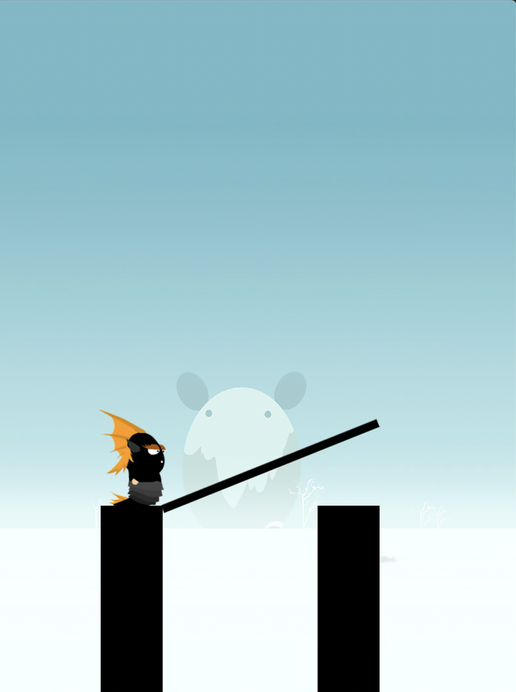
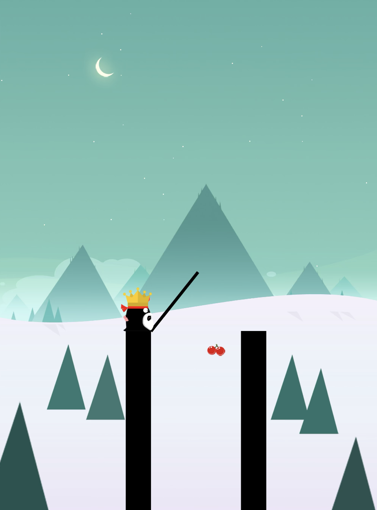

# Stick Hero

lien appstore

- [https://apps.apple.com/be/app/stick-hero/id918338898?l=f](https://apps.apple.com/be/app/stick-hero/id918338898?l=fr)

### Fonctionnement  du jeux

Le but est d’aller le plus loin possible avec le petit bonhomme en passant de pilier en pilier (rectangle noir). On passe d’un a l’autre grace a une barre qui relie les deux.

cette barre est generee en demarrant des pieds du bonhomme quand on touche l’ecran et continue de grandir verticalement tant que l’on maintient le doigt sur l’ecran.

Quand on enleve le doigt de l’ecran la barre arrete de grandir et tombe de -90° avec le point de rotation au pieds du bonhomme.

A la fin de la rotation si le bout de la barre rentre en colision avec le pilier notre score fait +1 et le jeux continue. Le bonhomme se deplace au centre sur le nouveau pilier puis tout ce deplace vers la gauche et un nouveau pilier a une distance différente et largeur différente rentre dans le canvas.

Si le bout de la barre rentre en colison avec le petit carre rouge au milieur du pilier on gagne plus de points

A la fin de la rotation si le bout de la barre ne rentre pas en colision avec le pilier. Le bonhomme se deplace au bout de la barre. La barre fait a nouveau une rotation de -90°. Le bonhomme tombe verticalement jusqu’a sortir du canvas. La partie est donc terminée vous pouvez recommencer avec un score a 0.

Lorsque le bonhomme est en train d’avancer sur la barre pour passer d’un pillier a l’autre. Si on touche l’ecran le bonhomme se retourne de l’autre cote de la barre pour pouvoir attraper des cerises (permettent de debloquer d’autre personnages dans le jeux). Si on le retouche avant le pilier il se remet dans le bon sens. Si il y a colision entre le bonhomme et le pilier c’est perdu.

### Fonctionnalités gardées

- un bouton play pour demarrer le jeu
- la barre qui grandi verticalement au maintien  du clique dans le canvas
- la barre qui tombe de -90° avec pour point de rotation le milieu du pilier sur lequel le bonhomme se trouve quand on lache le cique
- le bonhomme qui avance jusqu’au bout de la barre
- fin du jeux si on ne tombe pas en colision avec la barre sur le pilier
    - la barre fait une rotation de -90° et le bonhomme tombe verticalement jusqu’a sortir du canvas
    - un bouton replay pour redemarrer le jeux avec un score de 0
- le jeu continue si on tombe en colision avec la barre et le pilier
    - +2 points si on tombe en colision avec le petit carré rouge au milieu du pilier et le bout de la barre
    - +1 point si on tombe en colision avec le pilier en dehors du point rouge
    - les piliers, la barre et le bonhomme se deplacent vers la gauche
    - apparition d’un nouveau pilier de largeur random et de distance par rapport au précédent random aussi

### Points qu’il reste a faire

TOUT 😥

### video ytb d’explication

[https://www.youtube.com/watch?v=eue3UdFvwPo](https://www.youtube.com/watch?v=eue3UdFvwPo)